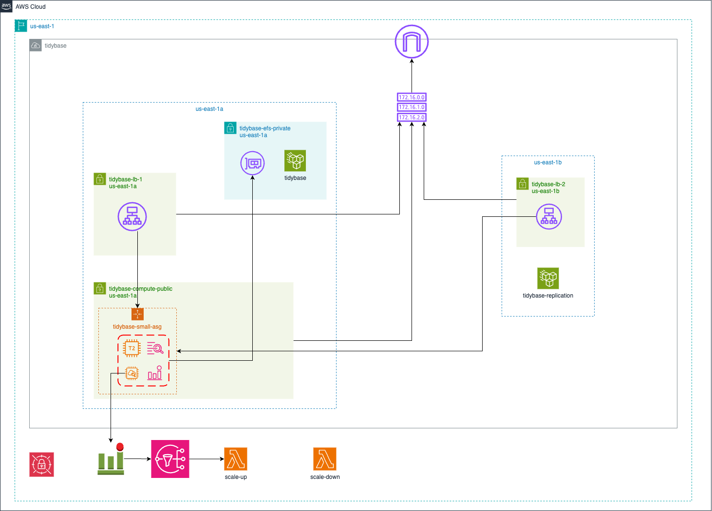
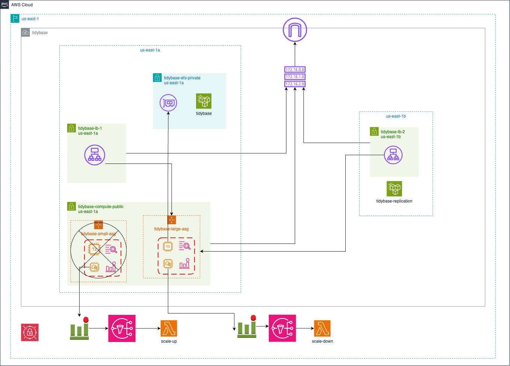
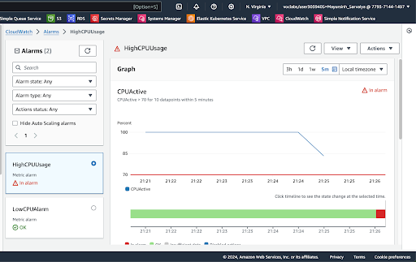
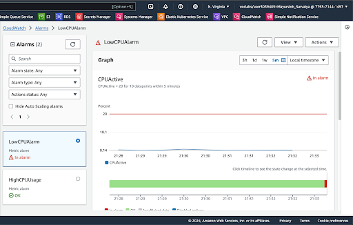

# tidybase

[pocketbase](https://pocketbase.io/) self-hosting on AWS using Terraform.

- Vertical Scaling on High/Low loads, with zero downtime
- Cross AZ EFS Backups

> CSCI 5411 Term Project - Summer 2024

## Architecture

The deployment spans two availability zones (us-east-1a and us-east-1b) within the us-east-1 region. The application is fronted by two load balancers, each situated in different availability zones, which distribute incoming traffic across the application instances. These instances are managed within an Auto Scaling Group (ASG) called tidybase-small-asg, allowing the application to automatically scale up or down based on demand, as monitored by CloudWatch. CloudWatch metrics trigger Lambda functions to adjust the number of running instances in the ASG, ensuring that the application can handle varying workloads. To maintain data consistency across instances, the architecture employs an Elastic File System (EFS) named tidybase-efs-private, which provides shared storage accessible to all EC2 instances.

EC2 has security rules such that it can only be accessed outside of an SSH port. Ports of HTTP and HTTPS can only be accessed inside VPC.

Now, consider the scenario of high load on small EC2. We have a CloudWatch alarm that will watch the CPU usage of EC2. If the current running EC2 is small and CPU usage exceeds 70 percent for five minutes then Cloudwatch will send the SNS topic to scale-up and then scale-up lambda will be triggered. That lambda will first set the large EC2 auto scaling group capacity to 1. After that instance spins up and becomes healthy, we change the load balancer to point to these new auto scaling groups’ instances. Then we set the old small auto scaling group to have 0 capacity and it will terminate small EC2. Since we attach EFS to the new EC2, there is zero data loss. This approach ensures zero downtime because at any point load balancer points to a healthy instance auto scaling group.

This can be achieved using ECS but then we have to use Docker, there is no official support of Docker image by pocketbase. We also have to perform initialisations like adding admin accounts, and setting backups.

## Examples

### High Load

### Low Load

